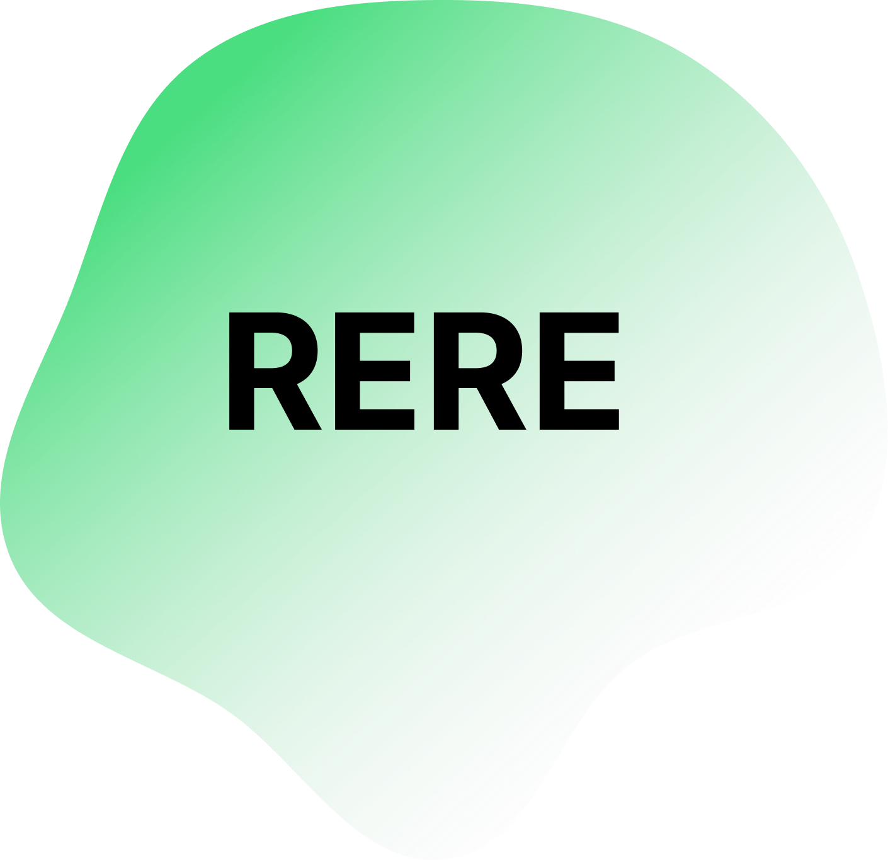

<p align="center">
   
</p>

Table of Contents
=======================

* [What is RERE?](#what-is-rere)
* [Cloning](#cloning)
* [Usage](#usage)
* [Community and Contributing](#community-and-contributing)
---

## What is RERE?
RERE's purpose is to present issues of urban flora and fauna by creating a network of sensors which monitor environmental conditions.

---

## Cloning

```sh
git clone https://github.com/a1eaiactaest/rere

cd rere/

git submodule update --init
```

Then run:

```sh
pip install -r requirements.txt
```

to satisfy python dependencies.

## Usage

### Local:

Start backend server:

```
python3 api/app.py
```

Read more about [API](api/README.md)  
Then start node.js running frontend:

```
cd frontend/ && npm start
```

### Docker:

Build and compose docker images:

```
docker-compose build -d
```

To stop them:

```
docker-compose stop
```

To remove:

```
docker-compose down
```

Now you can browse to `http://localhost:5000` to open the website.

## Community and Contributing

RERE's codebase is developed by [a1eaiactaest](https://a1eaiactaest.github.io) and users like you. We welcome both pull requests and issues on GitHub. Check out [the contributing docs](docs/CONTRIBUTING.md).

Our [Code of Conduct](docs/CODE_OF_CONDUCT.md).

And [follow me on Twitter](https://twitter.com/a1eaiactaest).