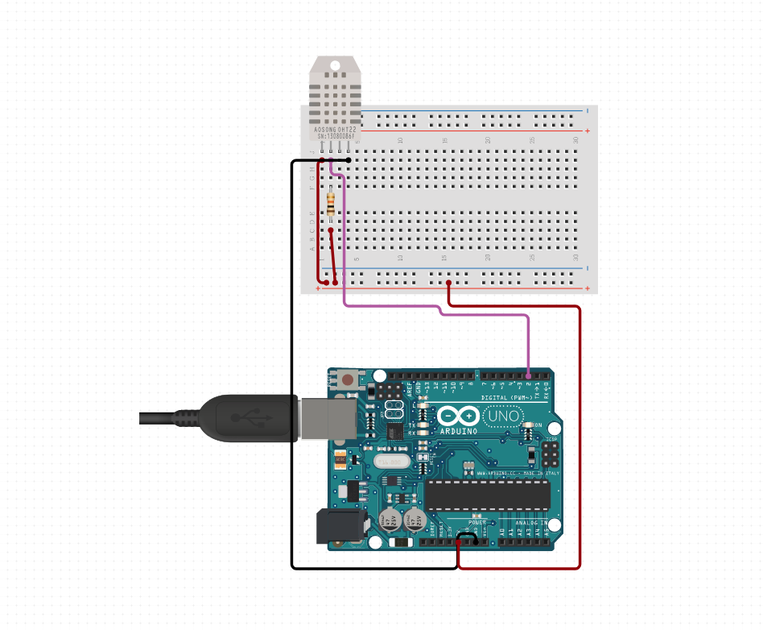

# dht11

## usage

### circuit

recreate arduino circuit given below:



### code

burn `dht11.ino` to your arduino.

finally:

```
./run.sh /dev/ttyACM0
# browse to localhost:5000
```

`/dev/ttyACM0` can replaced by any port your arduino is on.

bash script gives required privileges to arduino, so it'll probably ask you for sudo password.


output in format:
```
{"time": "yyyy-mm-dd hh:mm:ss.msmsms", "humidity": f, "temp": f, "hic": f}
```

is written every 5 seconds to `data.json` file. if it doesn't exist it's created.  
you can easily convert json file to csv or excel with online converters.


## todo

* add [] to json, it formats better (serialization function)
